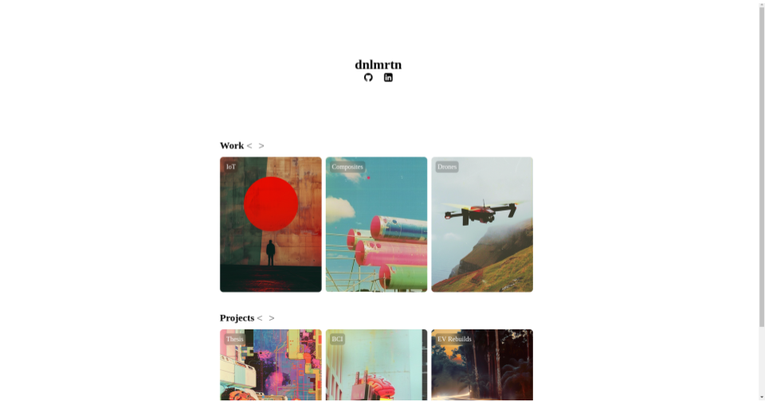

# dnlmrtn.com site Repository



## License

This project is licensed under a [Public Domain License](LICENSE). AKA steal as you please.

## Description

Source code for my personal site. HTML/JS/CSS. Feel free to steal as you please.

## Midjourney Prompts

All photos created by midjourney v6. Some prompts I used were
- space age image of <describe scenario>
- jean giraud moebius
- negative space
- --sref _link-to-image-of-film-light-leak_
inspired by x.com/radshaan

## How to Use

1. 
```bash
https://github.com/dnlmrtn/folio.git
```
2. 
```bash
cd /path/to/directory/
```
3. 
```bash
python3 -m http.server 8000
```
fafo for the rest


